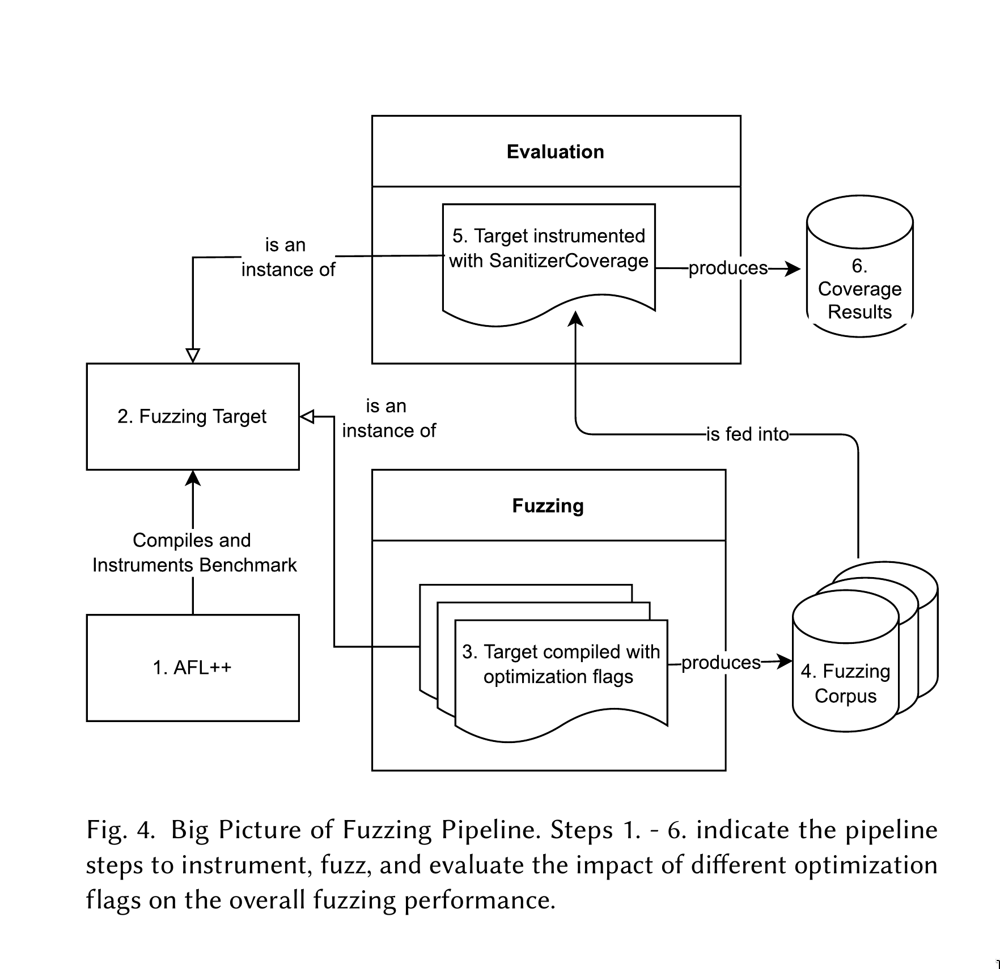
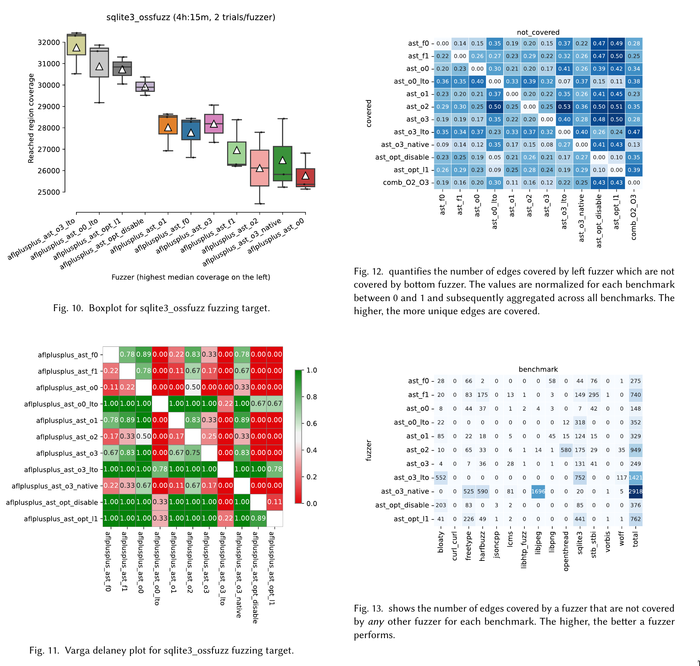

# Evaluating the Influence of Compiler Flags on Fuzzing

### Abstract

The automated software testing technique fuzzing has seen a golden age in the
last decade, with widespread use in industry and academia. On the hunt to find
vulnerabilities, fuzzing binaries are compiled with default compiler
optimizations such as -O2, or -O3, which remain the hard-coded default in
popular fuzzers such as AFL++. On a binary level, software compiled from the
same source code may vastly differ in control flow depending on used compilation
flags. In this work, we aim to analyze the impact of different compiler
optimizations on the fuzzing process and provide further insight. We influence
compilation passes of the clang/LLVM compiler and analyze their impact on the
fuzzing performance of AFL++. We integrate our work into Fuzzbench, an
open-source fuzzing pipeline, and run experiments on real-world benchmarks. Our
preliminary fuzzing results indicate that there is a delicate trade-off between
runtime performance and code complexity. While our results show significant
differences on the scale of individual benchmarks, when summarizing across the
whole bench suite, there is no evidence to suggest a statistical difference in
fuzzing performance.

Report: [22-06-11_ast_influence_compilerflags_fuzzing.pdf](./22-06-11_ast_influence_compilerflags_fuzzing.pdf)

    

    

Collaboration with Matthew Weingarten as part of semester project in
Automated Software Testing, in Advanced Software Technologies group at
ETH Zurich.

Spring 2022, https://ast.ethz.ch/
